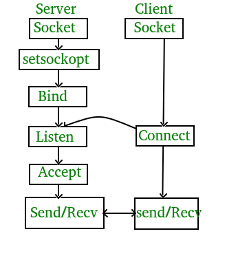

Compile server program and client program as :
`gcc server.c -o server`
`gcc client.c -o client`

Start the server in one Terminal:
`./server`

In another Terminal, start the client:
`./client`

 

Concept Diagram: 

